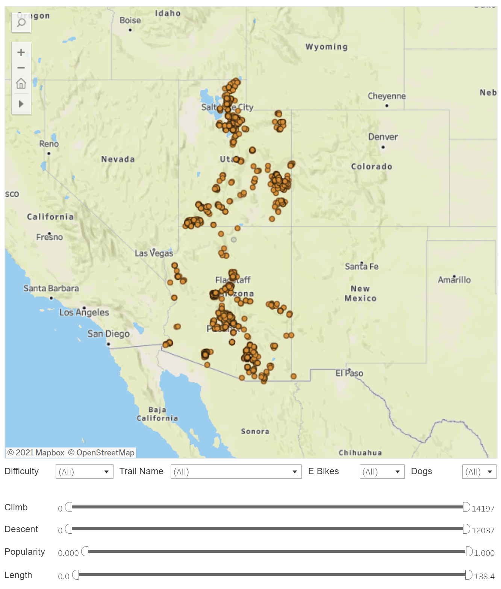
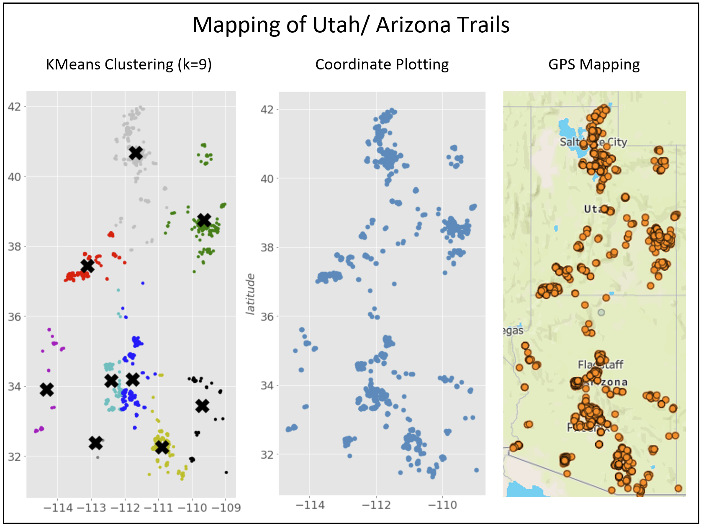

#    Arizona & Utah MTB Trail Recommender Engine 
---

### Ryan McDonald- Data Scientist 

 **Click Links to Find me!**  
     
---   
### Problem Statement   
For anyone new to mountain biking, or new to a specific trail area, the task can be daunting:
        
“Which trail should I ride?”   

“How am I going to get back to the car?”
  
“Which trails will offer the best training?”

“Am I going to get hurt riding this particular trail?”

The wrong choice can set a rider up for failure, or even worse… injury.  In hopes of providing new-to-the-area riders an alternative to blind guesses, a trail recommender system has been developed to better guide riders to more enjoyable riding experiences!
This project will provide two, value-added resources to riders!

-	A rider will be able to select certain attributes they want to experience on the trail.  Adjusting distance, climbing, descent and trail difficulty, etc. will provide the user with a trail to enter into a content=based recommender system that will display the top 10 most similar trails to try!
-	User data will also be pulled and a rider could use the user-based binary recommender to link up with similar riders!

---

## Executive Summary

Two different types of recommenders were developed with data pulled from MTB Project mountain bike trails in Arizona and Utah. A content-based trail recommender, and a collaborative binary user recommender.  These two models take in a matrix of pairwise distances and output a list of features based on cosine similarity scores in respect to the trail or user that was entered into the recommender. The biggest effort for this project was retrieving and cleaning the data.
   
   -  Trail data required extensive cleaning and formatting. Data also needed to be segregated into several separate dataframes to be utilized for the recommenders as well as the trail dashboard.
   
   -  An accompanying web app was developed with Streamlit and deployed on Heroku for user to be able to interact with trail features as well as run the content-based trail recommenders for Arizona and Utah mountain bike trails.
        
        -  Click to access webapp!
        
        - A user-based binary recommender is available in '03' notebook.
            * To be released to web app once country-wide data is retrieved
        
### Arizona/ Utah trail Dashboard

           
---
### Data Description
Data utilized for the project analysis was obtained through utilization of the OctoParse web scrapper API tool.  Data was pulled from 6 unique pages within the MTB Project webpage (one of the leading organization for trail and user data within the mountain biking community).

Data was collected on all registered mountain bike trails in Utah and Arizona.  This project will be continued nationwide (an additional 40,000 trails) post-course when there is time (approx 13 days) to scrap the remainder of data needed.

User data was also scrapped from the web. Approximately 12,000 user check-ins were gathered from MTB Project and incorporated into the user-based collaborative binary rating recommender system.

Trail feature data along with user data collected is described, below:

**Data Dictionary created for this analysis**

| Feature           | dType | Description             |
|-------------------|-------|-------------------------|
| trail_name        | str   | length of trail (mi)    |
| length            | float | trail name              |
| difficulty        | str   | trail difficulty rating |
| longitude         | float | ordinate                |
| latitude          | float | ordinate                |
| trail_link        | str   | web link                |
| city              | str   | city name               |
| popularity        | float | popularity (0-1)        |
| rating            | float | user rating (0-5)       |
| local_club        | str   | club name               |
| local_club_site   | str   | web link                |
| land_manager      | str   | organization name       |
| land_manager_site | str   | web link                |
| tot_climb         | float | total trail climb       |
| tot_descent       | float | total trail descent     |
| ave_grade         | float | slope of trail (avg.)   |
| max_grade         | float | max slope               |
| max_elevation     | float | highest point on trail  |
| min_elevation     | float | lowest point on trail   |
| dog_policy        | str   | are dogs allowed?       |
| e_bike_policy     | str   | are e-bikes allowed?    |
| user_name         | str   | first name, last name   |

**The following databases were utilized in analysis:**

| Database Utilized            | Features Within Database                                         |
|------------------------------|------------------------------------------------------------------|
| Pandas                       |                                                                  |
| Numpy                        |                                                                  |
| matplotlib                   | pyplot                                                           |
| re                           |                                                                  |
| os                           |                                                                  |
| seaborn                      |                                                                  |
| glob                         |                                                                  |
| sys                          |                                                                  |
| SKLearn - preprocessing      | MinMaxScalar, OneHotEncoder, Standard Scalar                     |
| SKLearn - Impute             | KNNImputer                                                       |
| SKLearn - Metrics.Pairwise   | pairwise_distances, cosine_similarity                            |
| SKLearn - Cluster            | KMeans                                                           |
| streamlit                    |                                                                  |
| streamlit.components.v1      | components                                                       |
| scipy                        | sparse                                                           |

---      
### Analysis 

1. A function was developed to handle all of the user data cleaning for each states raw data retrieved from MTB Project.

    * Cleaning provided correctly formatted user data in structured CSV files that could then be manipulated in another notebook to create the recommender.

2. A function was also developed to handle formatting and scaling of the nearly 2000 trail datapoints and all the subsequent trail stats within each point. This function will be utilized again once the remainder of nationwide trail data has been successfully gathered. 

    * Again, this data was separated into several CSV files (some scaled, some combined, etc.) in order to be used for the trail dashboard as well as the content-based recommenders. 
  
3. All data was tranferred into a sparse matriz base don pairwise distances to other trails/users.  This could be used to find cosine similarities for all cobincations of trails or users and entered into the recommenders. 

For some exploratory EDA, KMeans Clustering with unsupervised learning was utilized to group/cluster trails together.  The results of the clustering, in comparison to actual geographic data was very correlated. 
  
  
  
3.  Additional supporting analysis is provided in the code notebook for review, as well as additional insights. In depth and detailed processing and review are featured throughout the code notebook within markdown and code- formatted lines. 

4. Goals for future development include:
    - Adding a radius search feature so riders can choose only trails within a specified range.  This will help once the remainder of trails, nation-wide, are added to the recommender. 
    - Users will also be able to choose specific riding areas, specified by KMeans clustering results.
    - The user-based collaborative recommender will also be added to the webapp once nationwide data is gathered.

---
### Conclusions and Recommendations
   
Choosing which trail to ride shouldn't be a guess.  With the recommenders developed in this project and deployed onto the production webapp, users now have the confidence needed to try new trails and experienc great solo-riding in new areas!

The tools utilized in this project can very easily be carried over into other recommenders for hiking, climbing, or any other outdoor activity. As more data is collected, additional functionalities may be added into the recommender (user selected activity types, user logging of trails already utilized).  The options are expansive, but the recommender provided is a great start!